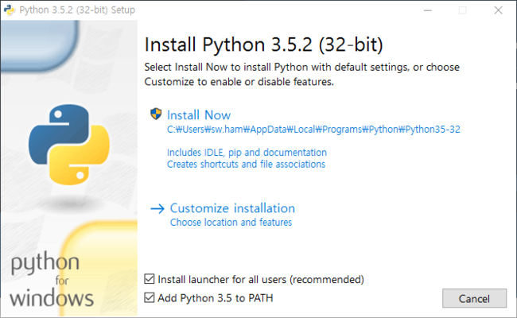

## 크롬드라이버 설치 필수
 크롬 버전 확인: chrome://version/ (주소창에 입력)   
 크롬 드라이버 다운로드 **크롬이랑 같은 버전이여야함**: http://chromedriver.storage.googleapis.com/index.html
   
## GUI프로그램           
 첫 실행시 권한 허락후 강제 종료(Ctrl+c or 작업관리자)    
 실행시 콘솔창(검은화면)이 나오고 입력창이 뜹니다 실행 버튼을 누르면 응답없음이 뜨고 진행과정은 콘솔창에 표기됩니다   

## 파이썬 프로그램
## 설치방법
HighColl.py 다운로드: https://drive.google.com/file/d/1Az05rd0SJxpWrgMP-harP9euRnHKy88Z/view?usp=sharing   
파이썬 다운로드: https://www.python.org/downloads/release/python-382/   
   
**체크박스 2개다 체크**

윈도우 검색에서 명령 프롬프트 검색후 실행      
- **pip install bs4 입력**   
- **pip install selenium 입력**   
- **pip install moviepy 입력**   

사용법은 위 사용법.pptx파일 
